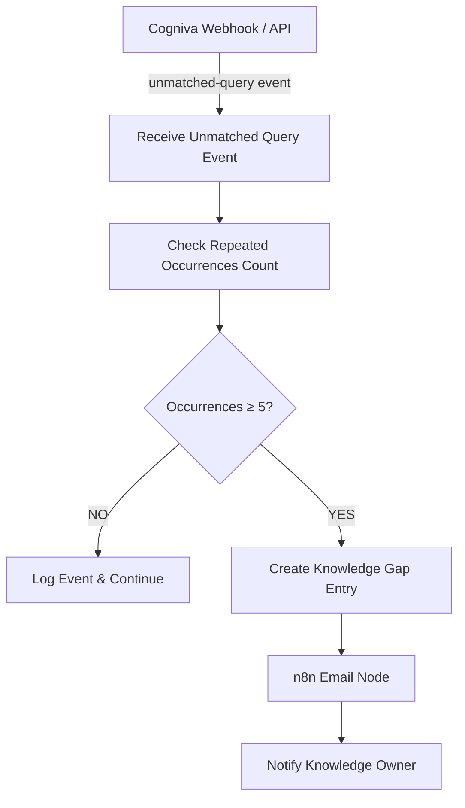
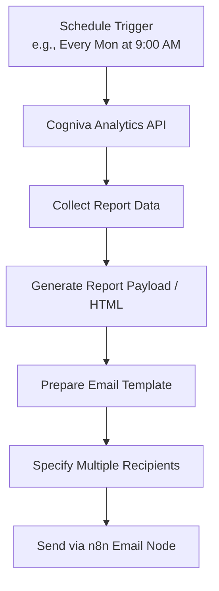

# Cogniva n8n Workflows Architecture Specification

This document details the architecture for the two n8n automation workflows designed for the **Cogniva Enterprise AI Platform**. These workflows handle automated Knowledge Gap alerts and scheduled analytics reporting.

---

## 1. Workflow 1 — Cogniva Knowledge Gap Alert

### Overview
Automates the detection and notification process when users submit queries that the Cogniva RAG system cannot answer (unmatched queries). When a query fails to match knowledge sources repeatedly (≥ 5 times), a Knowledge Gap item is generated and flagged to the Knowledge Owner via email.



### Flow Breakdown
1. **Trigger**: Cogniva Backend Webhook (`POST /webhooks/unmatched-query`)
2. **Event Payload**:
   ```json
   {
     "query": "string",
     "user_id": "string",
     "timestamp": "ISO-8601",
     "confidence_score": 0.0
   }
   ```
3. **Threshold Logic**:
   - Query occurrences count checked against database / cache.
   - If `count < 5`: Silent log & terminate flow.
   - If `count >= 5`: Proceed to gap creation & alert.
4. **Action**:
   - Create Knowledge Gap record in Cogniva Postgres database (`knowledge_gaps` table).
   - Trigger n8n SMTP / SendGrid node sending alert email to Knowledge Owner with query context.

---

## 2. Workflow 2 — Cogniva Analytics Report

### Overview
Schedules and delivers recurring (e.g. weekly) executive and operational analytics reports aggregating platform usage, top queries, system health, and Knowledge Hub metrics.



### Flow Breakdown
1. **Trigger**: n8n Cron/Schedule Trigger (e.g., `0 9 * * 1` - Every Monday at 9:00 AM).
2. **Data Collection**:
   - Call Cogniva Analytics API (`GET /api/analytics/weekly-summary`).
   - Collect query volume, resolution rates, top unmatched queries, vector counts, and active users.
3. **Report Generation**:
   - Format data into clean HTML summary email.
4. **Distribution**:
   - Dispatch formatted email report to configured list of stakeholder emails.

---

*Note: This architecture is stored in knowledge for implementation when ready.*
