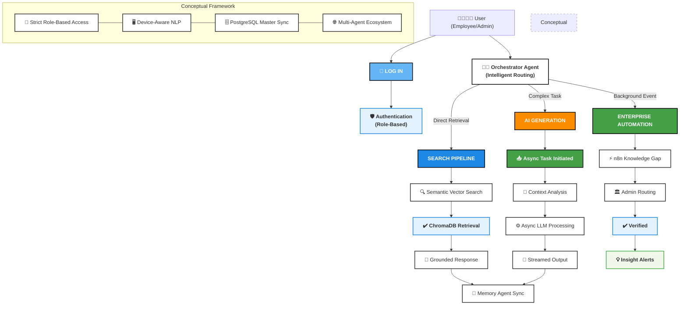

# Cogniva Architecture Diagram

> [!TIP]
> I have also designed a highly polished, stylized HTML version of this diagram that perfectly visually matches your original reference image (with emojis, custom arrows, and exact layout colors). 
> You can open it in your browser: [cogniva_architecture.html](file:///d:/projects/Cogniva/docs/cogniva_architecture.html)

Here is the functional, embeddable Mermaid flowchart version of the requested architecture:

