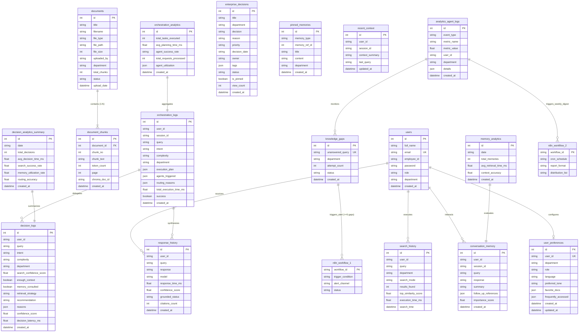

# Cogniva Enterprise AI Platform — Active Database Schema Specification

**Database Engine:** PostgreSQL (Neon.tech Cloud / Local PostgreSQL)  
**ORM Framework:** SQLAlchemy (Python 3.11)  
**Total Active PostgreSQL Tables:** 17 Tables  
**Total Architectural Entities:** 19 (17 Database Tables + 2 n8n Workflow Entities)  
**Status:** 100% Verified & Production Ready  

---


---

## Entity-Relationship System Schema Diagram



---

## 📖 Schema Diagram Legend & Visual Notation Guide

```
┌─────────────────────────────────────────────────────────────────────────────────────────────┐
│                                VISUAL LINE SYMBOL BREAKDOWN                                │
├───────────────────────────────┬─────────────────────────────────────────────────────────────┤
│  ───○─────────K────           │  Zero-to-Many (0 .. N) — Optional Parent / Child            │
│  ───|─────────K────           │  One-to-Many  (1 .. N) — Mandatory Parent                   │
│  ───|─────────|────           │  One-to-One   (1 .. 1) — Strict Single Mapping             │
│  ┆ - - - - - - - ┆➔           │  Logical Cross-Module Reference (No SQL FK Constraint)      │
└───────────────────────────────┴─────────────────────────────────────────────────────────────┘
```

### 1. Line Ending Symbols (Bubbles, Bars & Crow's Feet)

- **○ (Circle / Bubble = Optional / Zero):**
  - Represents **Optionality ($0$)**. 
  - Placed near a table to indicate that a parent row can exist without child rows (e.g., a newly registered `user` with $0$ `search_history` records).
- **| (Vertical Bar = Mandatory / One):**
  - Represents **Mandatory Presence ($1$)**.
  - Indicates that the child record MUST be linked to a valid parent record (e.g., `document_chunks.document_id` cannot be null).
- **< or K (Crow's Foot = Many):**
  - Represents **Multiple Records ($N$)**.
  - Placed on the child entity end of the relationship.

---

### 2. Line Styles (Solid vs. Dashed Lines)

- **Solid Line (────────): Strict SQL Foreign Key Constraint**
  - Represents an active, hard foreign key constraint enforced in PostgreSQL (e.g., `FOREIGN KEY (document_id) REFERENCES documents(id) ON DELETE CASCADE`).
- **Dashed Line (┆ - - - - ┆): Logical Cross-Module Reference**
  - Represents a software-level logical reference across AI Agent modules.
  - Used where Python agent services match IDs in code (e.g. `orchestration_logs` referencing `decision_logs` or `knowledge_gaps` triggering `n8n_workflows`) without creating restrictive SQL database locks.

---

### 3. Key & Constraint Badges
- **`[PK]` (Purple Badge):** Primary Key — Auto-incrementing integer identifier.
- **`[FK]` (Pink Badge):** Foreign Key — SQL relational pointer.
- **`[UK]` (Teal Badge):** Unique Key — Enforces row uniqueness across the table.

---

## Verified 17 Active Database Tables

### 1. `users`
Stores enterprise user accounts, roles, departments, and password hashes.

| Column Name | Data Type | Constraints / Defaults | Description |
| :--- | :--- | :--- | :--- |
| `id` | `INTEGER` | `PRIMARY KEY`, Auto-increment | Unique User ID |
| `full_name` | `VARCHAR(100)` | `NOT NULL`, Default: `'Akash M'` | User full name |
| `email` | `VARCHAR(150)` | `UNIQUE`, `NOT NULL` | Enterprise email address |
| `employee_id` | `VARCHAR(50)` | `NULLABLE`, Default: `'EMP-2026-8942'` | Organizational Employee ID |
| `password` | `VARCHAR(255)` | `NULLABLE` | Bcrypt hashed password |
| `role` | `VARCHAR(100)` | Default: `'Product Manager / Enterprise Analyst'` | RBAC Role (`Admin`, `Analyst`, `Viewer`) |
| `department` | `VARCHAR(100)` | Default: `'Engineering & Product'` | Assigned organizational department |
| `created_at` | `TIMESTAMPTZ` | Server Default: `func.now()` | Account registration timestamp |

---

### 2. `documents`
Stores metadata for ingested enterprise files in Knowledge Hub.

| Column Name | Data Type | Constraints / Defaults | Description |
| :--- | :--- | :--- | :--- |
| `id` | `INTEGER` | `PRIMARY KEY`, Auto-increment | Unique Document ID |
| `title` | `VARCHAR(255)` | `NULLABLE` | Display title |
| `filename` | `VARCHAR(255)` | `NOT NULL` | Original uploaded filename |
| `file_type` | `VARCHAR(50)` | Default: `'pdf'` | File extension (`pdf`, `docx`, `txt`, `csv`) |
| `file_path` | `VARCHAR(500)` | `NULLABLE` | Local server filesystem path |
| `file_size` | `INTEGER` | Default: `0` | File size in bytes |
| `uploaded_by` | `VARCHAR(100)` | Default: `'Akash M'` | User ID / Name of uploader |
| `department` | `VARCHAR(100)` | Default: `'Engineering & Product'` | Scoped department tag |
| `total_chunks` | `INTEGER` | Default: `0` | Count of generated text chunks |
| `status` | `VARCHAR(50)` | Default: `'Indexed & Active'` | Processing status (`Processing`, `Active`, `Failed`) |
| `upload_date` | `TIMESTAMPTZ` | Server Default: `func.now()` | Upload date |
| `created_at` | `TIMESTAMPTZ` | Server Default: `func.now()` | System insertion timestamp |

---

### 3. `document_chunks`
Holds individual text chunks extracted from documents and maps them to ChromaDB vector IDs.

| Column Name | Data Type | Constraints / Defaults | Description |
| :--- | :--- | :--- | :--- |
| `id` | `INTEGER` | `PRIMARY KEY`, Auto-increment | Unique Chunk ID |
| `document_id` | `INTEGER` | `FOREIGN KEY` $\rightarrow$ `documents.id` (`CASCADE`) | Parent document reference |
| `chunk_no` | `INTEGER` | `NOT NULL` | Sequential chunk index |
| `chunk_text` | `TEXT` | `NOT NULL` | Extracted text snippet |
| `token_count` | `INTEGER` | Default: `0` | Estimated word / token length |
| `page` | `INTEGER` | `NULLABLE` | Source page number |
| `chroma_doc_id` | `VARCHAR(255)` | `NULLABLE` | Corresponding ChromaDB vector UUID |
| `created_at` | `TIMESTAMPTZ` | Server Default: `func.now()` | Creation timestamp |

---

### 4. `search_history`
Logs user hybrid search queries, performance latency, and match metrics for Data Scout.

| Column Name | Data Type | Constraints / Defaults | Description |
| :--- | :--- | :--- | :--- |
| `id` | `INTEGER` | `PRIMARY KEY`, Auto-increment | Unique Search Record ID |
| `user_id` | `VARCHAR(100)` | Default: `'EMP-2026-8942'` | User executing search |
| `query` | `TEXT` | `NOT NULL` | Raw search query |
| `department` | `VARCHAR(100)` | Default: `'Engineering & Product'` | Department filter |
| `search_mode` | `VARCHAR(50)` | Default: `'Hybrid'` | Search strategy (`Hybrid`, `Semantic`, `BM25`) |
| `results_found` | `INTEGER` | Default: `0` | Number of returned chunks |
| `top_similarity_score` | `FLOAT` | Default: `0.0` | Highest vector similarity score |
| `execution_time_ms` | `FLOAT` | Default: `0.0` | Execution latency in milliseconds |
| `search_time` | `TIMESTAMPTZ` | Server Default: `func.now()` | Query timestamp |
| `timestamp` | `TIMESTAMPTZ` | Server Default: `func.now()` | System log timestamp |

---

### 5. `response_history`
Stores generated RAG answers, groundedness scores, latency, and citations count for Insight Desk.

| Column Name | Data Type | Constraints / Defaults | Description |
| :--- | :--- | :--- | :--- |
| `id` | `INTEGER` | `PRIMARY KEY`, Auto-increment | Unique Response ID |
| `user_id` | `VARCHAR(100)` | Default: `'EMP-2026-8942'` | Recipient User ID |
| `query` | `TEXT` | `NOT NULL` | Input user query |
| `response` | `TEXT` | `NOT NULL` | Synthesized answer text |
| `model` | `VARCHAR(100)` | Default: `'Ollama Qwen 2.5 3B'` | LLM Model name |
| `response_time` | `FLOAT` | Default: `0.0` | Generation latency (seconds) |
| `response_time_ms` | `FLOAT` | Default: `0.0` | Generation latency (milliseconds) |
| `confidence_score` | `FLOAT` | Default: `98.5` | Groundedness confidence % |
| `grounded_status` | `VARCHAR(50)` | Default: `'100% Grounded'` | Validation status |
| `citations_count` | `INTEGER` | Default: `1` | Total cited source snippets |
| `created_at` | `TIMESTAMPTZ` | Server Default: `func.now()` | Creation timestamp |

---

### 6. `orchestration_logs`
Execution traces for multi-agent workflows handled by Cogniva Orchestrator.

| Column Name | Data Type | Constraints / Defaults | Description |
| :--- | :--- | :--- | :--- |
| `id` | `INTEGER` | `PRIMARY KEY`, Auto-increment | Orchestration Log ID |
| `user_id` | `VARCHAR` | Default: `'default_user'` | User ID |
| `session_id` | `VARCHAR` | Default: `'session_orchestrator'` | Session ID |
| `query` | `VARCHAR` | `NOT NULL` | Trigger query |
| `intent` | `VARCHAR` | Default: `'General Inquiry'` | Inferred intent |
| `complexity` | `VARCHAR` | Default: `'Medium'` | Complexity rating |
| `department` | `VARCHAR` | Default: `'Engineering & Product'` | Department |
| `execution_plan` | `JSON` | `NULLABLE` | Ordered list of agents executed |
| `agents_triggered` | `JSON` | `NULLABLE` | Per-agent status and timing |
| `routing_reasons` | `JSON` | `NULLABLE` | Routing decision rationale |
| `aggregated_context_summary` | `VARCHAR` | `NULLABLE` | Synthesized execution summary |
| `total_execution_time_ms` | `FLOAT` | Default: `0.0` | Total workflow latency (ms) |
| `planning_time_ms` | `FLOAT` | Default: `8.4` | Intent parsing latency (ms) |
| `success` | `BOOLEAN` | Default: `True` | Workflow success flag |
| `created_at` | `TIMESTAMPTZ` | Server Default: `func.now()` | Execution timestamp |

---

### 7. `orchestration_analytics`
System-wide agent utilization and execution metrics.

| Column Name | Data Type | Constraints / Defaults | Description |
| :--- | :--- | :--- | :--- |
| `id` | `INTEGER` | `PRIMARY KEY`, Auto-increment | Analytics ID |
| `total_tasks_executed` | `INTEGER` | Default: `1420` | Total tasks handled |
| `avg_planning_time_ms` | `FLOAT` | Default: `8.4` | Average planning latency |
| `agent_success_rate` | `VARCHAR` | Default: `'99.8%'` | Overall agent success % |
| `total_requests_processed` | `INTEGER` | Default: `3890` | Request volume |
| `agent_utilization` | `JSON` | `NULLABLE` | Utilization breakdown by agent |
| `created_at` | `TIMESTAMPTZ` | Server Default: `func.now()` | Timestamp |

---

### 8. `decision_logs`
Stores multi-criteria decision analysis (MCDA) runs and trade-off results for Decision Engine.

| Column Name | Data Type | Constraints / Defaults | Description |
| :--- | :--- | :--- | :--- |
| `id` | `INTEGER` | `PRIMARY KEY`, Auto-increment | Decision Log ID |
| `user_id` | `VARCHAR(100)` | Default: `'default_user'` | User ID |
| `query` | `TEXT` | `NOT NULL` | Evaluation prompt / query |
| `intent` | `VARCHAR(100)` | `NOT NULL` | Decision intent category |
| `complexity` | `VARCHAR(50)` | Default: `'Medium'` | Decision complexity (`Low`, `Medium`, `High`, `Critical`) |
| `department` | `VARCHAR(100)` | Default: `'Engineering & Product'` | Department context |
| `search_confidence_score` | `FLOAT` | Default: `95.0` | Evidence search score |
| `enough_context` | `BOOLEAN` | Default: `True` | Sufficiency flag |
| `memory_consulted` | `BOOLEAN` | Default: `True` | Memory consultation flag |
| `multiple_docs_needed` | `BOOLEAN` | Default: `False` | Multi-doc requirement |
| `retrieval_strategy` | `VARCHAR(255)` | `NOT NULL` | Strategy path |
| `recommendation` | `TEXT` | `NOT NULL` | Formatted decision recommendation |
| `reasons` | `JSON` | Default: `[]` | Bulleted reasoning steps |
| `confidence_score` | `FLOAT` | Default: `96.5` | Overall decision confidence % |
| `routing_target` | `VARCHAR(100)` | Default: `'Response Agent'` | Target routing destination |
| `decision_latency_ms` | `FLOAT` | Default: `12.8` | Execution latency in ms |
| `created_at` | `TIMESTAMPTZ` | Server Default: `func.now()` | Timestamp |

---

### 9. `decision_analytics_summary`
Aggregated metrics for decision-making throughput and accuracy.

| Column Name | Data Type | Constraints / Defaults | Description |
| :--- | :--- | :--- | :--- |
| `id` | `INTEGER` | `PRIMARY KEY`, Auto-increment | Record ID |
| `date` | `VARCHAR(50)` | Indexed | Metric date |
| `total_decisions` | `INTEGER` | Default: `0` | Count of decisions |
| `avg_decision_time_ms` | `FLOAT` | Default: `12.8` | Average latency |
| `search_success_rate` | `FLOAT` | Default: `97.5` | Search success % |
| `memory_utilization_rate` | `FLOAT` | Default: `94.2` | Memory usage % |
| `routing_accuracy` | `FLOAT` | Default: `99.4` | Routing accuracy % |
| `created_at` | `TIMESTAMPTZ` | Server Default: `func.now()` | Timestamp |

---

### 10. `conversation_memory`
Stores turn-by-turn chat interactions for conversational context recall in Memory Agent.

| Column Name | Data Type | Constraints / Defaults | Description |
| :--- | :--- | :--- | :--- |
| `id` | `INTEGER` | `PRIMARY KEY`, Auto-increment | Memory ID |
| `user_id` | `VARCHAR(100)` | Default: `'EMP-2026-8942'` | User ID |
| `session_id` | `VARCHAR(100)` | Default: `'default_session'` | Active Session UUID |
| `query` | `TEXT` | `NOT NULL` | User turn prompt |
| `response` | `TEXT` | `NOT NULL` | Assistant response |
| `summary` | `TEXT` | `NULLABLE` | Concise turn summary |
| `follow_up_references` | `JSON` | `NULLABLE` | Referenced topics |
| `importance_score` | `FLOAT` | Default: `0.5` | Context weight (0.0 – 1.0) |
| `created_at` | `TIMESTAMPTZ` | Server Default: `func.now()` | Creation timestamp |

---

### 11. `user_preferences`
Personalization settings and user profiles.

| Column Name | Data Type | Constraints / Defaults | Description |
| :--- | :--- | :--- | :--- |
| `id` | `INTEGER` | `PRIMARY KEY`, Auto-increment | Record ID |
| `user_id` | `VARCHAR(100)` | `UNIQUE`, Default: `'EMP-2026-8942'` | User ID |
| `department` | `VARCHAR(100)` | Default: `'Engineering & Product'` | Department |
| `role` | `VARCHAR(100)` | Default: `'Product Manager'` | Title / Role |
| `language` | `VARCHAR(50)` | Default: `'English'` | Output language |
| `preferred_tone` | `VARCHAR(50)` | Default: `'Professional'` | Response tone |
| `favorite_docs` | `JSON` | Default: `[]` | Bookmarked document IDs |
| `frequently_accessed` | `JSON` | Default: `[]` | Frequently searched terms |
| `created_at` | `TIMESTAMPTZ` | Server Default: `func.now()` | Creation timestamp |
| `updated_at` | `TIMESTAMPTZ` | Auto-update | Last update timestamp |

---

### 12. `enterprise_decisions`
Records organization-wide policies and strategic decisions for search and memory retrieval.

| Column Name | Data Type | Constraints / Defaults | Description |
| :--- | :--- | :--- | :--- |
| `id` | `INTEGER` | `PRIMARY KEY`, Auto-increment | Decision Record ID |
| `title` | `VARCHAR(255)` | `NOT NULL` | Decision title |
| `department` | `VARCHAR(100)` | Default: `'Engineering & Product'` | Department |
| `decision` | `TEXT` | `NOT NULL` | Final decision summary |
| `reason` | `TEXT` | `NOT NULL` | Underlying rationale |
| `priority` | `VARCHAR(50)` | Default: `'High'` | Priority level |
| `decision_date` | `VARCHAR(50)` | `NULLABLE` | Date formatted string |
| `owner` | `VARCHAR(100)` | Default: `'Enterprise Admin'` | Decision owner |
| `tags` | `JSON` | Default: `[]` | Domain tags |
| `status` | `VARCHAR(50)` | Default: `'Active'` | Status (`Active`, `Archived`) |
| `is_pinned` | `BOOLEAN` | Default: `False` | Pinned flag |
| `view_count` | `INTEGER` | Default: `0` | View count |
| `created_at` | `TIMESTAMPTZ` | Server Default: `func.now()` | Timestamp |

---

### 13. `pinned_memories`
Holds user-pinned context snippets for persistent injection into agent prompts.

| Column Name | Data Type | Constraints / Defaults | Description |
| :--- | :--- | :--- | :--- |
| `id` | `INTEGER` | `PRIMARY KEY`, Auto-increment | Pin ID |
| `memory_type` | `VARCHAR(50)` | `NOT NULL` | Type (`Fact`, `Rule`, `Policy`) |
| `memory_ref_id` | `INTEGER` | `NULLABLE` | Reference ID |
| `title` | `VARCHAR(255)` | `NOT NULL` | Pin title |
| `content` | `TEXT` | `NOT NULL` | Pinned snippet text |
| `department` | `VARCHAR(100)` | Default: `'General Enterprise'` | Department scope |
| `created_at` | `TIMESTAMPTZ` | Server Default: `func.now()` | Creation timestamp |

---

### 14. `recent_context`
Maintains current session context summary for low-latency retrieval.

| Column Name | Data Type | Constraints / Defaults | Description |
| :--- | :--- | :--- | :--- |
| `id` | `INTEGER` | `PRIMARY KEY`, Auto-increment | Context ID |
| `user_id` | `VARCHAR(100)` | Default: `'default_user'` | User ID |
| `session_id` | `VARCHAR(100)` | Default: `'default_session'` | Active Session ID |
| `context_summary` | `TEXT` | `NULLABLE` | Active context summary |
| `last_query` | `TEXT` | `NULLABLE` | Last executed query |
| `updated_at` | `TIMESTAMPTZ` | Auto-update | Update timestamp |

---

### 15. `memory_analytics`
Performance tracking for Memory Agent operations.

| Column Name | Data Type | Constraints / Defaults | Description |
| :--- | :--- | :--- | :--- |
| `id` | `INTEGER` | `PRIMARY KEY`, Auto-increment | Metric ID |
| `date` | `VARCHAR(50)` | Indexed | Metric date |
| `total_memories` | `INTEGER` | Default: `0` | Total stored memories |
| `avg_retrieval_time_ms` | `FLOAT` | Default: `14.2` | Average latency (ms) |
| `context_accuracy` | `FLOAT` | Default: `98.6` | Accuracy % |
| `created_at` | `TIMESTAMPTZ` | Server Default: `func.now()` | Creation timestamp |

---

### 16. `analytics_agent_logs`
System event logger for operational performance tracking.

| Column Name | Data Type | Constraints / Defaults | Description |
| :--- | :--- | :--- | :--- |
| `id` | `INTEGER` | `PRIMARY KEY`, Auto-increment | Telemetry Log ID |
| `event_type` | `VARCHAR(50)` | Indexed | Event category (`search`, `response`, `document`) |
| `metric_name` | `VARCHAR(100)` | Indexed | Metric label |
| `metric_value` | `FLOAT` | Default: `0.0` | Numerical metric value |
| `user_id` | `VARCHAR(100)` | Default: `'EMP-2026-8942'` | User ID |
| `department` | `VARCHAR(100)` | Default: `'Engineering & Product'` | Department |
| `details` | `JSON` | `NULLABLE` | Event JSON payload |
| `created_at` | `TIMESTAMPTZ` | Server Default: `func.now()` | Event timestamp |

---

### 17. `knowledge_gaps`
Tracks search queries with missing knowledge base coverage for n8n/APScheduler alerts.

| Column Name | Data Type | Constraints / Defaults | Description |
| :--- | :--- | :--- | :--- |
| `id` | `INTEGER` | `PRIMARY KEY`, Auto-increment | Gap Record ID |
| `unanswered_query` | `VARCHAR(500)` | `NOT NULL`, `UNIQUE` | Unmatched search query text |
| `department` | `VARCHAR(100)` | Default: `'Engineering & Product'` | Requesting department |
| `attempt_count` | `INTEGER` | Default: `1` | Number of times asked |
| `status` | `VARCHAR(50)` | Default: `'Pending Resolution'` | Status (`Pending Resolution`, `Resolved`) |
| `created_at` | `TIMESTAMPTZ` | Server Default: `func.now()` | First detected timestamp |

---

## 2 Non-Database Automation Workflow Entities

### Entity 18: `n8n_workflow_1` (Knowledge Gap Alert Automation)
- **Type:** Automated External Webhook Workflow
- **Trigger:** Threshold check ($\ge 5$ unanswered queries in `knowledge_gaps`)
- **Action:** Triggers instant email notification & Slack alert to Knowledge Base Admins.

### Entity 19: `n8n_workflow_2` (Scheduled Weekly Analytics Report)
- **Type:** Scheduled Cron Workflow
- **Trigger:** Cron Schedule (Every Monday at 9:00 AM)
- **Action:** Aggregates weekly telemetry from `analytics_agent_logs` and distributes executive PDF report.
