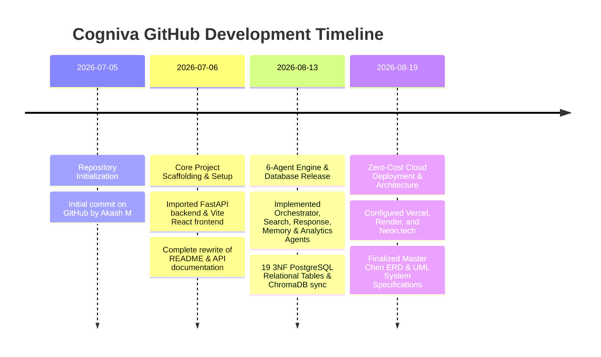

# Cogniva Repository — GitHub Activity & Commit Timeline Documentation

This document provides a comprehensive analysis and chronological timeline of all GitHub activity, commit history, developmental milestones, and architectural evolutions for the **Cogniva Enterprise Intelligence Platform** repository (`AKASH-M-hub/Cogniva`).

---

## 📊 1. Commit History Overview & Statistics

* **Repository Name**: `AKASH-M-hub/Cogniva`
* **Primary Contributor**: Akash M (`AKASH M` / `Akash M`)
* **Primary Branch**: `main`
* **Total Commit Count**: 6 Major Commits
* **Development Phase**: July 2026 – August 2026
* **Production Stack**: FastAPI (Python 3.11), React (Vite 5), PostgreSQL (Neon.tech), ChromaDB, Ollama (Qwen 2.5 3B), Vercel & Render.

---

## 🗓️ 2. Chronological GitHub Commit Timeline

| Commit Hash | Date | Author | Summary & Scope of Changes | Key Architectural Impact |
| :--- | :--- | :--- | :--- | :--- |
| **`ba4ca5b`** | **2026-08-19** | Akash M | `docs: update architecture specifications, cloud deployment configs and system models` | **Zero-Cost Cloud Architecture**: Added Vercel (Frontend), Render (Backend), Neon.tech (Serverless PostgreSQL) configs, Master Chen ER diagram specs, UML behavioral diagrams, and native FastAPI scheduler integrations. |
| **`c1a139e`** | **2026-08-13** | Akash M | `feat: Complete multi-agent platform architecture, PostgreSQL schema optimization, and UI refinements` | **Core Platform Release**: Implemented the complete 6-Agent engine architecture, 19 PostgreSQL relational schema models, Knowledge Hub vector sync, Analytics Workspace, and Indigo enterprise UI design system. |
| **`8066c86`** | **2026-07-06** | Akash M | `docs: rewrite root README with setup and API guide` | **Documentation & Setup**: Complete rewrite of root `README.md`, adding local setup guides, environment secret specs, virtual environment setup, and API endpoint directories. |
| **`4fcce7c`** | **2026-07-06** | Akash M | `Merge remote main history` | **Branch Synchronization**: Resolved and merged remote `main` branch commit history to establish clean baseline. |
| **`c16c51a`** | **2026-07-06** | Akash M | `Initial project import` | **Scaffolding Import**: Imported initial backend FastAPI folder structure, frontend React Vite boilerplate, base models, and dependencies. |
| **`8657661`** | **2026-07-05** | AKASH M | `Initial commit` | **Repository Initialization**: Initialized Git repository on GitHub under account `AKASH-M-hub`. |

---

## 🚀 3. Developmental Phase & Milestone Breakdown

### Phase 1: Project Initialization & Scaffolding *(July 5 - July 6, 2026)*
* Established the core GitHub repository `AKASH-M-hub/Cogniva`.
* Scaffolded backend folder structure (`app/api`, `app/agents`, `app/services`, `app/models`, `app/schemas`, `app/database`).
* Scaffolded Vite + React SPA frontend.

### Phase 2: Documentation & Developer Experience *(July 6, 2026)*
* Created comprehensive developer onboarding documentation in `README.md`.
* Standardized environment variable structures (`DATABASE_URL`, `SECRET_KEY`, `OLLAMA_URL`, `GEMINI_API_KEY`).
* Configured Swagger (`/docs`) and ReDoc (`/redoc`) API documentation routers.

### Phase 3: Multi-Agent Engine & Relational Schema Release *(August 13, 2026)*
* **Multi-Agent Architecture**: Built `OrchestratorAgent`, `DecisionAgent`, `SearchAgent`, `MemoryAgent`, `ResponseAgent`, and `AnalyticsAgent`.
* **Database Optimization**: Engineered 19 3NF PostgreSQL tables covering users, documents, chunks, search history, conversation memory, decision logs, and telemetry.
* **Vector Synchronization**: Linked document chunking with ChromaDB vector store.
* **Enterprise UI**: Applied consistent Indigo enterprise design across all workspaces.

### Phase 4: Zero-Cost Cloud Deployment & System Documentation *(August 19, 2026)*
* **Cloud Infrastructure Strategy**: Configured **Vercel** (Frontend), **Render** (FastAPI Backend), and **Neon.tech** (Serverless PostgreSQL) for $0/month deployment.
* **Automation Subsystem**: Configured native `FastAPI BackgroundTasks` and `APScheduler` for event triggers & scheduled reporting.
* **System Specifications**: Created Master Chen ER Diagrams, UML Communication Diagrams, Interaction Overview Diagrams, and Tech Stack Documentation.

---

## 📈 4. Repository Code Distribution

* **Backend**: Python 3.11 / FastAPI (REST endpoints, SQLAlchemy ORM, Multi-Agent pipelines, ChromaDB vector store)
* **Frontend**: JavaScript (React 18, Vite 5, TailwindCSS, Lucide React, Recharts)
* **Database**: PostgreSQL SQL schemas & migrations (19 relational tables)
* **Documentation**: Markdown architectural specs & Mermaid behavioral diagrams (`docs/`)

---

*Document generated and maintained by Akash M for Cogniva Repository Analytics.*
